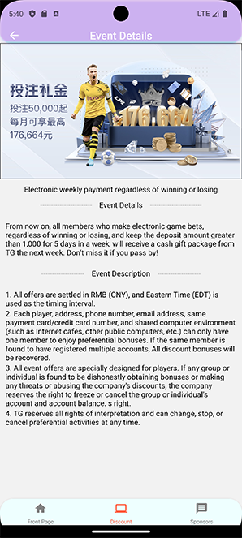
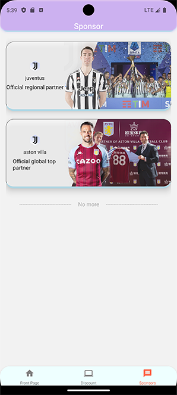

# I'm in! (Under development)
I'm in! An app built in React-Native to create casual bets with your friends.

The App is not completed yet but if you want to test the current version out you need the following:

# How to run
You need node with a version of 20 or higher.

You need expo installed as well: [expo](https://docs.expo.dev/)

Clone the repo with ```git clone```

Run with ```npm start```


## Home


### Home-casino


### Discount


### Event-Detail


### Sponsor
